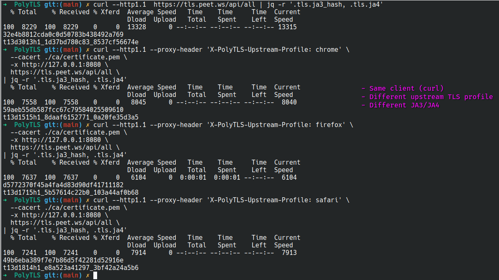

# PolyTLS

An **explicit** HTTP/1.1 `CONNECT` proxy that can run in:

- **Passthrough mode**: tunnels bytes (no TLS termination).
- **MITM mode**: terminates client TLS and originates a new upstream TLS connection using **BoringSSL** via `boring` + `tokio-boring`.

Docs: [docs/README.md](docs/README.md). Use this only on systems and traffic you own or are explicitly authorized to test.

## Demo

https://github.com/user-attachments/assets/bfcc8176-e02d-4f63-a709-6a2ce5af236a



## Architecture

PolyTLS is an **explicit** HTTP/1.1 `CONNECT` proxy. In passthrough mode it just tunnels bytes. In MITM mode it terminates client TLS and opens a new upstream TLS connection (optionally using a per-request "upstream profile").

```ascii
MITM mode (terminates client TLS):

┌─────────┐  HTTP/1.1 CONNECT + Client TLS (terminated)  ┌─────────────┐   Upstream TLS (originated)    ┌──────────────┐
│ Client  │ ────────────────────────────────────────────►│ MITM Proxy  │ ─────────────────────────────► │ Target Server│
│         │ ◄────────────────────────────────────────────│             │ ◄───────────────────────────── │              │
└─────────┘            Decrypted / Relayed               └─────────────┘     Decrypted / Relayed        └──────────────┘
                                 │
                                 └──────────────────────────────────┐
                                                                    │
                                      ┌─────────────────────────────┴─────────────────────────────┐
                                      │                 Certificate Authority (CA)                │
                                      │              (On-the-fly leaf cert generation)            │
                                      └───────────────────────────────────────────────────────────┘

Passthrough mode (tunnels TLS end-to-end):

┌─────────┐  HTTP/1.1 CONNECT + TLS (tunneled)  ┌─────────────┐   TCP relay            ┌──────────────┐
│ Client  │ ───────────────────────────────────►│ Proxy       │ ─────────────────────► │ Target Server│
│         │ ◄───────────────────────────────────│             │ ◄───────────────────── │              │
└─────────┘          Encrypted / Relayed        └─────────────┘  Encrypted / Relayed   └──────────────┘
```

See the full step-by-step flow (including the `PrefixedStream` "leftover bytes" trick and the ALPN compatibility check): [`docs/architecture/proxy-mitm-flow.md`](docs/architecture/proxy-mitm-flow.md)

### MITM flow (TL;DR)

1. Parse `CONNECT` (+ optional `X-PolyTLS-Upstream-Profile`).
2. Reply `200 Connection Established`.
3. Load/generate Root CA → mint leaf cert for `host`.
4. TLS-accept client using minted cert.
5. TLS-connect upstream (default profile or selected profile).
6. Enforce ALPN compatibility.
7. Bidirectional relay until EOF.

## Why

Sometimes the thing you're debugging isn't your HTTP request – it's the **TLS handshake** that happens *before* any HTTP exists. CDNs, WAFs, bot defenses, and "smart" load balancers can behave differently depending on the client's TLS characteristics.

PolyTLS is a small, explicit `CONNECT` proxy that helps you test that reality:

- **Passthrough mode**: tunnel bytes as-is (no TLS termination).
- **MITM mode**: terminate client TLS, then open a *new* upstream TLS connection.
- **Upstream TLS profiles**: pick an upstream "browser-like" TLS profile per request (so you can A/B behavior across profiles without changing your client).

Use it for **authorized testing / reproducible debugging**: "does this endpoint break only when the handshake looks like X?", "does the origin negotiate a different protocol?", "why does a vendor SDK work but curl doesn't?".


## Build

```bash
cargo build
```

Building `boring-sys` (BoringSSL) requires a working C/C++ toolchain and CMake on your system.

## Build docker image

```console
APP_VERSION=$(cargo pkgid --manifest-path Cargo.toml | cut -d '@' -f2); docker build --platform linux/amd64 --build-arg BUILD_DATE="$(date +'%Y-%m-%dT%H:%M:%S%z')" \
    --build-arg COMMIT_SHA=$(git rev-parse HEAD) \
    --build-arg VERSION=$(cargo pkgid --manifest-path Cargo.toml | cut -d '@' -f2) \
    . -f docker/Dockerfile \
   -t polytls:$APP_VERSION
```

## Run

### Passthrough (default)

```bash
cargo run -- --listen 127.0.0.1:8080
curl -v -x http://127.0.0.1:8080 https://example.com/
```

### MITM mode (TOML config)

```bash
cargo run -- --config config/example.toml
```

Or without a config file:

```bash
cargo run -- --mode mitm --listen 127.0.0.1:8080
```

On first run in MITM mode, a root CA is created at `./ca/private.key` and `./ca/certificate.pem`.
Install `./ca/certificate.pem` into your **test client** trust store to avoid certificate warnings.

For a quick smoke test without installing the CA (not recommended for real testing), you can use:

```bash
curl -vk -x http://127.0.0.1:8080 https://example.com/
```

### Testing self-signed upstream servers (lab)

If the **upstream** TLS server uses a self-signed certificate or private CA, either add that CA to the proxy:

```bash
cargo run -- --config config/example.toml --upstream-ca-file ./path/to/upstream-ca.pem
```

Or disable proxy→upstream verification entirely (lab only):

```bash
cargo run -- --config config/example.toml --upstream-insecure-skip-verify
```

### Selecting an upstream TLS profile per request

In MITM mode, you can select which upstream TLS profile the proxy uses by adding a header to the HTTP `CONNECT` request:

```bash
curl --proxy-header 'X-PolyTLS-Upstream-Profile: chrome-143-macos-arm64' -x http://127.0.0.1:8080 https://example.com/
```

Other built-in profiles:
- `firefox-145-macos-arm64`
- `safari-26.2-macos-arm64`

Profiles can be defined in TOML under `[profiles]` (see [config/example.toml](config/example.toml)).
