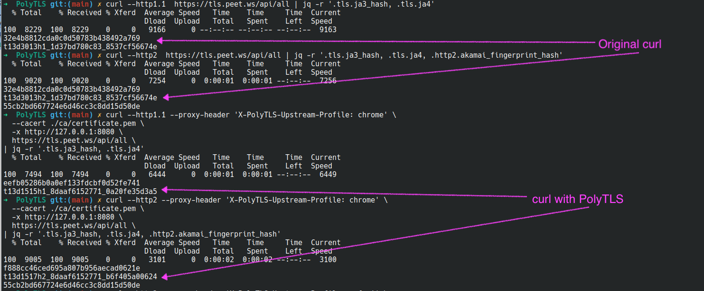

# PolyTLS

An HTTP/1.1 `CONNECT` or SOCKS5 `CONNECT` proxy that can run in:

- **Passthrough mode**: tunnels bytes (no TLS termination).
- **MITM mode**: terminates client TLS and originates a new upstream TLS connection using **BoringSSL** via `boring` + `tokio-boring`.

Docs: [docs/README.md](docs/README.md). Use this only on systems and traffic you own or are explicitly authorized to test.

## Demo

https://github.com/user-attachments/assets/3c2567d8-398a-4cdc-8307-54ef5b8873b2



## Architecture

PolyTLS accepts HTTP/1.1 `CONNECT` by default and can also run as a SOCKS5 `CONNECT` proxy. In passthrough mode it just tunnels bytes. In MITM mode it terminates client TLS and opens a new upstream TLS connection (optionally using a per-request "upstream profile").
It supports tunneling **HTTP/2** (via ALPN negotiation) by enforcing protocol consistency between the client and upstream connections – after TLS we relay bytes; HTTP/1.1 vs HTTP/2 is purely **ALPN + byte relay**.

```ascii
MITM mode (terminates client TLS):

┌─────────┐  HTTP/1.1 CONNECT + Client TLS 
│         │    (terminated, ALPN H1/H2)    ┌─────────────┐         Upstream TLS 
│         │                                │             │     (originated, ALPN matched)  ┌──────────────┐
│ Client  │ ──────────────────────────────►│ MITM Proxy  │ ───────────────────────────────►│ Target Server│
│         │ ◄──────────────────────────────│             │ ◄───────────────────────────────│              │
└─────────┘       Decrypted / Relayed      └─────────────┘     Decrypted / Relayed         └──────────────┘
                           │
                           └────────────────────────┐
                                                    │
                      ┌─────────────────────────────┴─────────────────────────────┐
                      │                 Certificate Authority (CA)                │
                      │              (On-the-fly leaf cert generation)            │
                      └───────────────────────────────────────────────────────────┘

Passthrough mode (tunnels TLS end-to-end):

┌─────────┐  HTTP/1.1 CONNECT + TLS (tunneled)  ┌─────────────┐   TCP relay            ┌──────────────┐
│ Client  │ ───────────────────────────────────►│ Proxy       │ ─────────────────────► │ Target Server│
│         │ ◄───────────────────────────────────│             │ ◄───────────────────── │              │
└─────────┘          Encrypted / Relayed        └─────────────┘  Encrypted / Relayed   └──────────────┘
```

See the full step-by-step flow (including the `PrefixedStream` "leftover bytes" trick and the ALPN compatibility check): [docs/architecture/proxy-mitm-flow.md](docs/architecture/proxy-mitm-flow.md)

### MITM flow (TL;DR)

1. Parse HTTP `CONNECT` or SOCKS5 `CONNECT` (+ optional upstream profile selection).
2. Reply `200 Connection Established` for HTTP, or SOCKS5 success for SOCKS5.
3. Load/generate Root CA → mint a leaf cert for the TLS identity name.
4. TLS-accept client using minted cert.
5. TLS-connect upstream (default profile or selected profile).
6. Enforce ALPN compatibility.
7. Bidirectional relay until EOF.

## Why

Sometimes the thing you're debugging isn't your HTTP request – it's the **TLS handshake** that happens *before* any HTTP exists. CDNs, WAFs, bot defenses, and "smart" load balancers can behave differently depending on the client's TLS characteristics.

PolyTLS is a small, explicit `CONNECT` proxy that helps you test that reality:

- **Passthrough mode**: tunnel bytes as-is (no TLS termination).
- **MITM mode**: terminate client TLS, then open a *new* upstream TLS connection. Supports **HTTP/1.1** and **HTTP/2** (via ALPN).
- **Upstream TLS profiles**: pick an upstream "browser-like" TLS profile per request (so you can A/B behavior across profiles without changing your client).

Use it for **authorized testing / reproducible debugging**: "does this endpoint break only when the handshake looks like X?", "does the origin negotiate a different protocol?", "why does a vendor SDK work but curl doesn't?".


## Build

```bash
cargo build
```

Building `boring-sys` (BoringSSL) requires a working C/C++ toolchain and CMake on your system.

## Build docker image

```console
APP_VERSION=$(cargo pkgid --manifest-path Cargo.toml | cut -d '@' -f2); docker build --platform linux/amd64 --build-arg BUILD_DATE="$(date +'%Y-%m-%dT%H:%M:%S%z')" \
    --build-arg COMMIT_SHA=$(git rev-parse HEAD) \
    --build-arg VERSION=$(cargo pkgid --manifest-path Cargo.toml | cut -d '@' -f2) \
    . -f docker/Dockerfile \
   -t polytls:$APP_VERSION
```

## Run

### Passthrough (default)

```bash
cargo run -- --listen 127.0.0.1:8080
curl -v -x http://127.0.0.1:8080 https://example.com/
```

### MITM mode (TOML config)

```bash
cargo run -- --config config/example.toml
```

Or without a config file:

```bash
cargo run -- --mode mitm --listen 127.0.0.1:8080
```

On first run in MITM mode, a root CA is created at `./ca/private.key` and `./ca/certificate.pem`.
Install `./ca/certificate.pem` into your **test client** trust store to avoid certificate warnings.

For a quick smoke test without installing the CA (not recommended for real testing), you can use:

```bash
curl -vk -x http://127.0.0.1:8080 https://example.com/
```

### SOCKS5 frontend

SOCKS5 can be used in passthrough or MITM mode:

```bash
cargo run -- --proxy-protocol socks5 --mode mitm --listen 127.0.0.1:1080
curl -vk --socks5-hostname 127.0.0.1:1080 https://example.com/
```

In MITM mode, a SOCKS5 request can carry either a domain target or an IP target:

- Domain target, for example `curl --socks5-hostname` or typical browser SOCKS5 traffic: PolyTLS uses the SOCKS5 domain as the client-facing certificate name and upstream TLS name, then verifies the client's ClientHello SNI matches it.
- IP target, for example `curl --socks5`: PolyTLS peeks the ClientHello before TLS termination. If SNI is present, it uses that SNI for the client-facing certificate and upstream TLS name while still dialing the SOCKS5 IP target. If SNI is missing, PolyTLS fails closed.

Chrome/Chromium SOCKS5 traffic normally follows the domain-target path for HTTPS URLs. `curl --socks5` is useful when you specifically need to test the IP-target/SNI recovery path.

Opening `https://<ip>/...` in a browser is not equivalent to the IP-target/SNI path above: the URL host, TLS SNI, certificate validation name, and HTTP `Host`/HTTP/2 `:authority` all become the IP address.

### Testing self-signed upstream servers (lab)

If the **upstream** TLS server uses a self-signed certificate or private CA, either add that CA to the proxy:

```bash
cargo run -- --config config/example.toml --upstream-ca-file ./path/to/upstream-ca.pem
```

Or disable proxy→upstream verification entirely (lab only):

```bash
cargo run -- --config config/example.toml --upstream-insecure-skip-verify
```

### Environment config overrides

Config files are loaded through `config-rs` and can be overridden with `POLYTLS__...` environment variables. Use double underscores for nested fields:

```bash
POLYTLS__PROXY__LISTEN__ADDRESS=127.0.0.1:1080 \
POLYTLS__PROXY__MODE=socks5 \
POLYTLS__PROXY__UPSTREAM__PROXY__ADDRESS=127.0.0.1:9050 \
cargo run -- --config config/example.toml
```

Precedence is: config file, then `POLYTLS__...` environment overrides, then explicit CLI flags.

### Chaining through an upstream SOCKS5 proxy

PolyTLS can route outbound proxy→target TCP connections through a configured SOCKS5 proxy:

```toml
[proxy.upstream.proxy]
protocol = "socks5"
address = "127.0.0.1:9050"
# dns = "proxy" # default: upstream SOCKS5 proxy resolves domain targets
# dns = "local" # optional: PolyTLS resolves locally and sends an IP target upstream
# username = "chain-user"
# password = "chain-password"
```

This works with both frontend protocols (`--proxy-protocol http-connect` / `explicit`, or `--proxy-protocol socks5`) and both data-plane modes (`passthrough` or `mitm`). In MITM mode, PolyTLS still terminates client TLS and originates the upstream TLS session itself; the chained SOCKS5 proxy only carries the TCP tunnel to the target.

By default, domain targets are sent to the chained SOCKS5 proxy as domains so the upstream proxy performs DNS resolution. Set `dns = "local"` only when you need PolyTLS to resolve the target locally and send the resulting IP address to the chained SOCKS5 proxy; MITM mode still uses the original hostname for certificate generation, SNI validation, and upstream TLS.

### Selecting an upstream TLS profile per request

In HTTP `CONNECT` MITM mode, you can select which upstream TLS profile the proxy uses by adding a header to the `CONNECT` request:

```bash
curl --proxy-header 'X-PolyTLS-Upstream-Profile: chrome-143-macos-arm64' -x http://127.0.0.1:8080 https://example.com/
```

In SOCKS5 MITM mode, put the profile in the SOCKS5 username. Both raw profile names and `profile=<name>` are accepted:

```bash
curl -vk \
  --socks5-hostname 127.0.0.1:1080 \
  --proxy-user 'profile=firefox-145-macos-arm64:' \
  https://example.com/
```

To exercise the SOCKS5 IP-target path with curl while keeping the URL/SNI/HTTP host as the DNS name, use `--socks5` instead:

```bash
curl -vk \
  --socks5 127.0.0.1:1080 \
  --proxy-user 'profile=firefox-145-macos-arm64:' \
  https://example.com/
```

Other built-in profiles:
- `firefox-145-macos-arm64`
- `safari-26.2-macos-arm64`

Profiles can be defined in TOML under `[profiles]` (see [config/example.toml](config/example.toml)).
