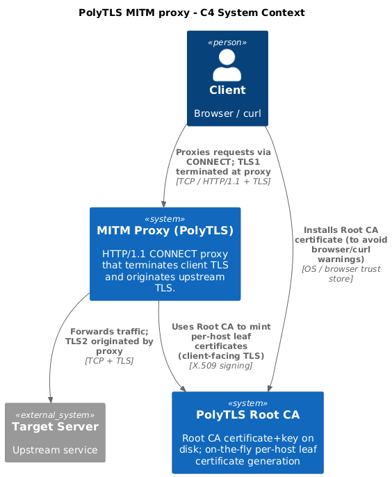
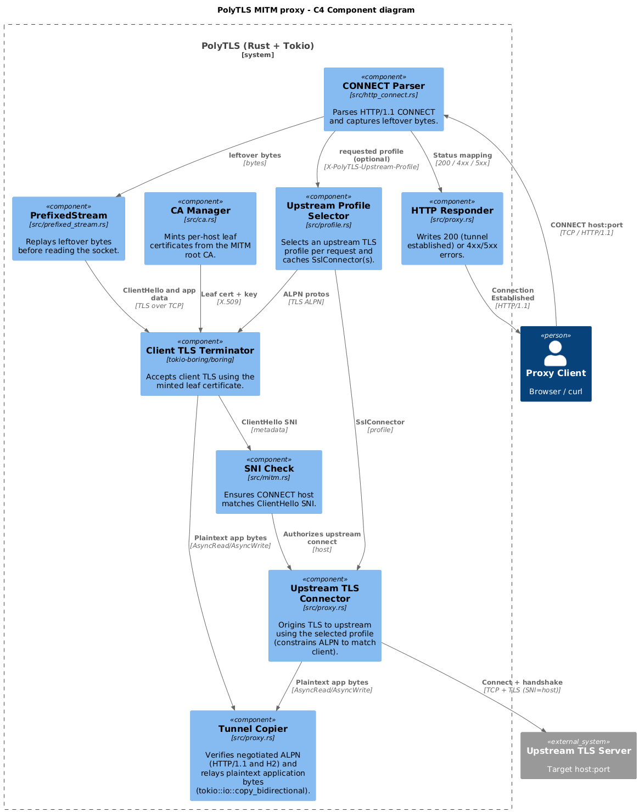

# MITM CONNECT flow (`handle_mitm`)

Primary implementation: [`src/proxy.rs:148`](../../src/proxy.rs#L148).

## Data path overview
- Client → proxy: HTTP/1.1 `CONNECT`, then TLS is terminated by the proxy.
- Proxy → upstream: a new TCP connection, then a new upstream TLS session is originated by the proxy.
- Proxy relays decrypted application bytes between the two TLS sessions.

## Diagram

### System diagram

Diagram source: [mitm-context.puml](../diagrams/c4/mitm-context.puml).

### Component diagram

Diagram source: [mitm-component.puml](../diagrams/c4/mitm-component.puml).

## Step-by-step
1. Read and parse the client's `CONNECT host:port` request; keep any bytes read past `\r\n\r\n` as `connect.leftover` ([`src/proxy.rs:164`](../../src/proxy.rs#L164), [`src/http_connect.rs:36`](../../src/http_connect.rs#L36)).
   - Optional: extract `X-PolyTLS-Upstream-Profile` to select an upstream TLS profile ([`src/http_connect.rs:7`](../../src/http_connect.rs#L7), [`src/http_connect.rs:92`](../../src/http_connect.rs#L92)).
2. Select the upstream TLS profile and fetch/build a cached `SslConnector` (unknown profile → `400`, other failures → `502`) ([`src/proxy.rs:175`](../../src/proxy.rs#L175), [`src/profile.rs:158`](../../src/profile.rs#L158)).
3. Dial upstream TCP with a timeout; send `502`/`504` on connect/timeout failures ([`src/proxy.rs:200`](../../src/proxy.rs#L200)).
4. Reply `HTTP/1.1 200 Connection Established` ([`src/proxy.rs:216`](../../src/proxy.rs#L216)).
5. Load the selected `UpstreamProfile` (mainly for the ALPN list used on the client-facing TLS acceptor) ([`src/proxy.rs:220`](../../src/proxy.rs#L220), [`src/profile.rs:154`](../../src/profile.rs#L154)).
6. Wrap the client socket in `PrefixedStream(connect.leftover, client)` so the next stage sees a contiguous stream ([`src/proxy.rs:227`](../../src/proxy.rs#L227), [`src/prefixed_stream.rs:1`](../../src/prefixed_stream.rs#L1)).
7. Mint a per-host leaf certificate from the MITM CA, build a TLS server acceptor, then complete the TLS handshake with the client ([`src/proxy.rs:228`](../../src/proxy.rs#L228), [`src/ca.rs:91`](../../src/ca.rs#L91), [`src/mitm.rs:16`](../../src/mitm.rs#L16)).
8. Validate that the client's SNI matches the CONNECT host ([`src/proxy.rs:235`](../../src/proxy.rs#L235), [`src/mitm.rs:66`](../../src/mitm.rs#L66)).
9. Configure and connect upstream TLS using the selected profile and verification policy. PolyTLS also applies an (in‑memory) upstream session cache keyed by `host:port`, so repeated connections may offer TLS resumption (`pre_shared_key`) ([`src/proxy.rs:242`](../../src/proxy.rs#L242), [`src/proxy.rs:250`](../../src/proxy.rs#L250), [`src/profile.rs:345`](../../src/profile.rs#L345)).
10. Ensure the client and upstream negotiated compatible ALPN to avoid protocol confusion:
    - If client selected an ALPN protocol (e.g. `h2`), forces upstream connection to use ONLY that protocol.
    - If upstream negotiation fails or mismatches (rare due to constraint), the connection is aborted.
    - If client had no ALPN, defaults upstream to `http/1.1`. ([`src/proxy.rs:265`](../../src/proxy.rs#L265)).
    - If the client negotiated `h2` and the upstream profile enables ALPS for `h2`, PolyTLS configures the ALPS codepoint (if enabled) and adds the `application_settings` (ALPS) extension to the upstream handshake ([`src/proxy.rs:279`](../../src/proxy.rs#L279), [`src/profile.rs`](../../src/profile.rs#L329), [`src/profile.rs`](../../src/profile.rs#L358)).
11. Relay application bytes until shutdown using `tokio::io::copy_bidirectional` ([`src/proxy.rs:323`](../../src/proxy.rs#L323)).

## Why `copy_bidirectional` works here
After both TLS handshakes complete, `tokio_boring::accept` and `tokio_boring::connect` return streams implementing `AsyncRead + AsyncWrite` where reads/writes are *plaintext application bytes*. TLS record parsing, encryption, and re-framing happen inside each TLS stream, so the proxy can treat them as generic full‑duplex byte streams and just pump bytes in both directions.

## Why `PrefixedStream` exists
`read_connect_request` can read past the end of the CONNECT headers (e.g., into the start of the tunneled data). In MITM mode that "tunneled data" begins with the client's TLS ClientHello. `PrefixedStream` replays those `leftover` bytes first, so no bytes are lost and the next protocol stage sees the correct byte sequence.

## Certificates and trust model (why `CaManager` exists)
In MITM mode, the proxy is a TLS server *from the client's perspective*. That means it must present a certificate that:
- matches the hostname the client thinks it's connecting to (e.g., `example.com`), and
- chains to a trust anchor the client trusts.

The proxy does not have the upstream server's private key, so it cannot legitimately present the upstream's real certificate. Instead, `CaManager` ([`src/ca.rs`](../../src/ca.rs)) acts as a local CA:
- It loads or creates the proxy's **Root CA** keypair and certificate (default: [`ca/private.key`](../../ca/private.key) and [`ca/certificate.pem`](../../ca/certificate.pem)).
- For each CONNECT host it "mints" a per-host **leaf certificate** (end-entity/server certificate) signed by that Root CA ([`CaManager::leaf_for_host`](../../src/ca.rs#L91)), and uses that leaf cert+key to accept the client's TLS handshake.

**Leaf certificate**: the server/end-entity certificate at the bottom of a certificate chain (Root CA → leaf). It's the certificate the proxy presents to the client for a specific host.

### Who must trust what
- **Client → proxy (MITM TLS)**: to avoid `curl -k/--insecure` / browser warnings, install the proxy's Root CA certificate (e.g., [`ca/certificate.pem`](../../ca/certificate.pem)) into the *client* trust store. This allows the minted per-host leaf certs to validate normally.
- **Proxy → upstream (upstream TLS)**: this is a separate verification path inside the proxy. Client-side insecure flags do not affect it. For lab/private-CA upstreams, configure the proxy with `proxy.upstream.ca_file` (preferred) or disable upstream verification (`proxy.upstream.insecure_skip_verify`, lab only).

## Per-request upstream TLS profiles
The proxy can select the upstream TLS ClientHello profile per CONNECT request using an optional header:

- Header: `X-PolyTLS-Upstream-Profile: <profile-name>`
- Curl example (adds a header to the CONNECT request):
  - `curl --proxy-header 'X-PolyTLS-Upstream-Profile: chrome-143-macos-arm64' --insecure -x http://127.0.0.1:8080 https://example.com/`

Profiles are configured in TOML under the `[profiles]` table ([`src/config.rs:7`](../../src/config.rs#L7)). If the header is not present, the proxy uses `proxy.upstream.default_profile` ([`src/config.rs:44`](../../src/config.rs#L44)).

## Why Chrome/Chromium profile is the highest fidelity
PolyTLS originates upstream TLS using BoringSSL (via the Rust `boring` crate) ([`src/profile.rs`](../../src/profile.rs)). Chromium-based browsers also use BoringSSL, so the `chrome-*` upstream profile is largely configuring the *same* TLS stack that real Chrome uses. In practice this makes Chrome/Chromium the easiest profile to get close to for JA3/JA4, while Firefox (NSS) and Safari (Apple TLS) can only be approximated within BoringSSL’s feature set.

## BoringSSL named groups limitation (FFDHE)
Some browser fingerprints (e.g., Firefox) advertise finite-field Diffie-Hellman named groups like `ffdhe2048` / `ffdhe3072` in `supported_groups`.

In PolyTLS, these values are applied via BoringSSL's `set_curves_list` (supported groups) ([`src/profile.rs:264`](../../src/profile.rs#L264)). With the current BoringSSL version, `set_curves_list` only accepts group names present in BoringSSL's internal `kNamedGroups` table, and the lookup path rejects unknown names:
- `kNamedGroups` table: https://github.com/google/boringssl/blob/a6f3c4c14e6515c8c7f213032be8dee3f18a9b19/ssl/ssl_key_share.cc#L438
- `ssl_name_to_group_id` lookup: https://github.com/google/boringssl/blob/a6f3c4c14e6515c8c7f213032be8dee3f18a9b19/ssl/ssl_key_share.cc#L496-L511

As a result, attempting to configure `ffdhe2048`/`ffdhe3072` via `curves_list` fails, and reproducing Firefox's full `supported_groups` list would require patching/forking BoringSSL rather than just configuration.

## Safari profile limitations (Apple TLS vs BoringSSL)
Safari's TLS implementation is provided by Apple (Secure Transport / Network.framework), not BoringSSL. Even with a "Safari-like" `UpstreamProfile`, the proxy is still bounded by what BoringSSL can express.

One practical example is legacy TLS 1.2 cipher suites: real Safari advertises ECDHE+3DES suites like `TLS_ECDHE_ECDSA_WITH_3DES_EDE_CBC_SHA` (`0xC008`) and `TLS_ECDHE_RSA_WITH_3DES_EDE_CBC_SHA` (`0xC012`) ([`real_safari.json`](../fingerprints/real/real_safari.json)). 
PolyTLS's Safari cipher string includes these names ([`src/profile.rs:37`](../../src/profile.rs#L37)), but the upstream ClientHello produced by BoringSSL does not include them (see [`curl_as_safari.json`](../fingerprints/via-polytls/curl_as_safari.json)), because those suites are not enabled/implemented in BoringSSL's supported cipher table (the BoringSSL codebase defines the IDs in `tls1.h`, but does not include them in `ssl_cipher.cc`).

Another example is `signature_algorithms`: the captured Safari sample includes a duplicate `rsa_pss_rsae_sha384` entry ([`real_safari.json`](../fingerprints/real/real_safari.json)). PolyTLS configures signature algorithms via BoringSSL’s `set_sigalgs_list` ([`src/profile.rs:269`](../../src/profile.rs#L269)), and BoringSSL rejects duplicate entries in that list, so PolyTLS cannot reproduce this Safari quirk exactly.

## BoringSSL ALPS codepoint caveat (`application_settings`)
JA4 considers extension IDs, so the ALPS `application_settings` codepoint matters for fingerprint parity.

- PolyTLS enables ALPS via BoringSSL’s `SSL_add_application_settings` ([`src/profile.rs`](../../src/profile.rs#L329)).
- BoringSSL supports switching from the legacy `application_settings` codepoint `17513` (`0x4469`) to the newer draft codepoint `17613` (`0x44cd`) via `SSL_set_alps_use_new_codepoint` ([`src/profile.rs`](../../src/profile.rs#L358)).
- PolyTLS applies this per upstream connection in `handle_mitm` ([`src/proxy.rs`](../../src/proxy.rs#L279)) based on the selected upstream profile (`UpstreamProfile.alps_use_new_codepoint`).
- You can override it per configured profile via `profiles.<name>.alps_use_new_codepoint` ([`src/config.rs`](../../src/config.rs#L59)).
